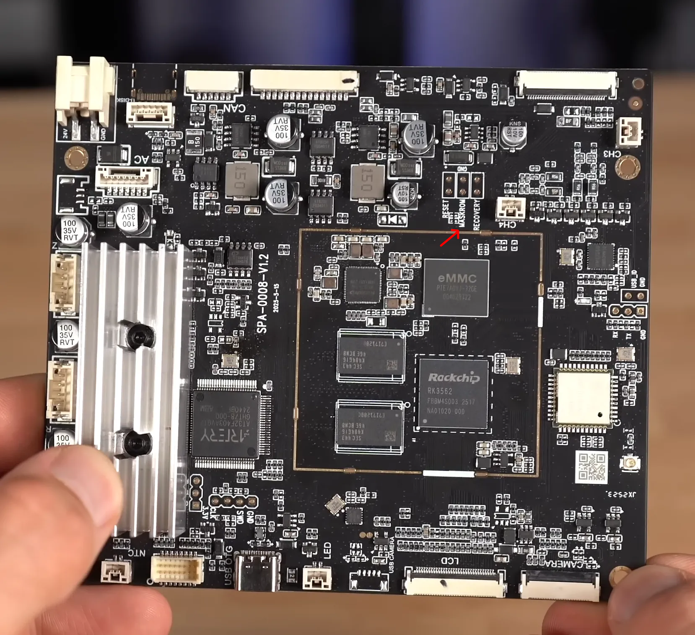

# Snapmaker U1 firmware research

Main goals:
- Research RFID encoding/KDF - https://github.com/SnapmakerResearchGroup/RFID
- Get root access to printer - [Debug mode](#Debug-mode)
- Implement custom RFID tag reading capabilities in "CFW"

# Hardware:

CPU: RK3562
RFID reader: FM175XX

# Firmware repository

| Version   | URL                                                                                       | SHA256                                                           |
|-----------|-------------------------------------------------------------------------------------------|------------------------------------------------------------------|
| 0.9.0.121 | https://public.resource.snapmaker.com/firmware/U1/U1_0.9.0.121_20251106132913_upgrade.bin | 8b4296bd7122485100607aa8ce73e60853447d016fa9affa99c1c3e7f67c7421 |

# Root

Users password hashes:
```
root:$5$eu8wDdiZh8$XX7iyka0CVnr.6rZ2CxA71A/Zuoq3Cz2k1t1WNtevA9:::::::
lava:$5$qeMHqpDjqkRkD$KcMqymy5Zu1CBhZoXmZX/oxJ4.TAWMF5OXdcNbHmIh6:::::::
```

Both passwords are `snapmaker`

# SSH

SSH server is dropbear (allows root login), but disabled in production builds

# Debug mode

Debug mode (that enables SSH) is enabled by generating debug file via `custom_misc gen-debug` command and then flashing result into `/dev/block/by-name/misc`.

You can't modify misc partition via firmware upgrade, so you need to create custom firmware that has access to SSH initially.

## Firmware patching

You have 2 ways to patch firmware:

1. Use [FirmwareRepacker](https://github.com/SnapmakerResearchGroup/FirmwareRepacker)'s `root-patch` command via [Automatic root patch](#Automatic-root-patch)
2. Do same manually, with ability to change firmware as you like via [DIY firmware patching](#DIY-firmware-patching)

### Automatic root patch

I've implemented automatic SSH server patch into FirmwareRepacker with help of [backhand](https://github.com/SnapmakerResearchGroup/backhand). This method will work on ANY OS!

Downsides are that you won't be able to modify firmware, and it is **YET UNTESTED** on real printer

Download latest binary release of FirmwareRepacker: https://github.com/SnapmakerResearchGroup/FirmwareRepacker/releases/latest

Unpack tar.gz or zip archive

Then run:

Linux/macOS:
```bash
snapmaker_firmware_repacker-<your-binary-name> patch-root --input U1_0.9.0.121_20251106132913_upgrade.bin
```

Windows:
```cmd
snapmaker_firmware_repacker-windows-x86_64.exe patch-root --input U1_0.9.0.121_20251106132913_upgrade.bin
```

Next follow [Installing firmware](#Installing-firmware)

### DIY firmware patching
You will need 3 tools:

[FirmwareRepacker](https://github.com/SnapmakerResearchGroup/FirmwareRepacker) - (un)packs RockChip firmware from/into Snapmaker U1 firmware upgrade format

[apftool-rs](https://github.com/SnapmakerResearchGroup/apftool-rs) - (un)packs RockChip firmware

unsquashfs and mksquashfs from squashfs-tools

Only firmware 0.9.0 is tested, other versions are on your own risk!

Guide assumes that you are running Linux on x86_64 with non-root user. **This method WON'T work on Windows**

**Root is MANDATORY for packing/unpacking SquashFS. You WILL brick your printer if you will nuke uids/gids**

```bash
wget -qO- https://github.com/SnapmakerResearchGroup/FirmwareRepacker/releases/download/v1.0.0/snapmaker_firmware_repacker-linux-x86_64.tar.gz | tar xz
wget -qO- https://github.com/SnapmakerResearchGroup/apftool-rs/releases/download/v1.1.0/afptool-rs-linux-x86_64.tar.gz | tar xz
chmod +x snapmaker_firmware_repacker-linux-x86_64 afptool-rs-linux-x86_64
wget https://public.resource.snapmaker.com/firmware/U1/U1_0.9.0.121_20251106132913_upgrade.bin
./snapmaker_firmware_repacker-linux-x86_64 unpack -i U1_0.9.0.121_20251106132913_upgrade.bin -o firmware_stage1
./afptool-rs-linux-x86_64 unpack firmware_stage1/update.img firmware_stage2
./afptool-rs-linux-x86_64 unpack firmware_stage2/embedded-update.img firmware_stage3
cd firmware_stage3
# root is MANDATORY for packing/unpacking SquashFS
sudo unsquashfs rootfs.img && rm rootfs.img
# here you can modify firmware in firmware_stage3/squashfs-root folder if you want, we will just disable debug check for SSH server (root as /etc/init.d belongs to UID 0)
sudo sed -i '6d' squashfs-root/etc/init.d/S50dropbear
sudo mksquashfs squashfs-root rootfs.img -comp gzip
cd ../
cp -r firmware_stage2 firmware_stage4
./afptool-rs-linux-x86_64 pack-rkaf --model RK3562 --manufacturer RK3562 firmware_stage3 firmware_stage4/embedded-update.img
cp -r firmware_stage1 firmware_stage5
./afptool-rs-linux-x86_64 pack-rkfw --chip RK3562 --version 1.0.0 --timestamp 1762435994 --code 0x02000000 firmware_stage4 firmware_stage5/update.img 
./snapmaker_firmware_repacker-linux-x86_64 pack -i firmware_stage5 --output patched.bin --version 0.9.0.122 --build-time 20251106132914 # bump build time and version
```

Before updating check output after `Creating 4.0 filesystem on rootfs.img, block size 131072.`:

```
Number of uids 3
root (0)
<user> (1000)
http (33)
Number of gids 4
root (0)
<user> (1000)
polkitd (102)
http (33)
```

**UIDS/GIDS MUST be same as this (`<user>` will be your 1000 user on host, username doesn't matter):**

**YOU WILL BRICK PRINTER IF YOU IGNORE THIS**

Also check for hardlinks:

```
created 494 hardlinks
```

**If there are none, you did something wrong!**

### Installing firmware

Copy `patched.bin` file to USB drive, connect it to printer

Then update printer (About -> Firmware version -> Local Update -> patched.bin). After update, SSH server will start at port 22, access with user `root` and password `snapmaker`

After SSH to printer run those commands:
```shell
/usr/bin/custom_misc gen-debug
dd if=debug_misc.img of=/dev/block/by-name/misc bs=1 conv=notrunc
```

This will enable debug mode, and you will be able to SSH with root/lava user even after firmware upgrade (unless they will change something)

**Your warranty is now void. I'm not responsible for bricked devices, your house burned down due to thermal runaway or thermonuclear war™.**

Credits to [srinn](https://github.com/srinn) for testing this method!

Example file
```xxd
000063e0: 0000 0000 0000 0000 0000 0000 0000 0000  ................  
000063f0: 0000 0000 0000 0000 0000 0000 0000 0000  ................  
00006400: 127e 84cb 0001 030d 6462 6700 0000 0000  .~......dbg.....  
00006410: 0000 0000 0000 0000 0000 0000 0000 0000  ................  
00006420: 0000 0000 0000 0000 0000 0000 0000 0000  ................  
...
000064e0: 0000 0000 0000 0000 0000 0000 0000 0000  ................  
000064f0: 0000 0000 0000 0000 0000 0000 0000 0000  ................
```
Where:

127E84CB - constant

0001 - debug mode enable?

030D - checksum

646267 - ASCII "dbg"

Why no prepatched firmware? I don't want to distribute Snapmaker's intellectual property

# Flashing via MaskRom

**WIP, feel free to test**



https://androidmtk.com/rockchip-android-tool or https://github.com/linux-rockchip/rkflashtool might be helpful

# MQTT

By default uses `cli0:snapmaker` credentials

# Firmware upgrade structure

Firmware structure is similar to matryoshka. I will explain from .bin update file to OS image

1. Snapmaker U1 firmware. Has 4 files packed: update.img, at32f403a.bin, at32f415.bin, MCU_DESC. 

Where:

update.img is RockChip RKFW image (see 2.)

at32f403a.bin is main MCU firmware

at32f415.bin is print head firmware (flashed to each one)

MCU_DESC is main MCU version

Header is encrypted, hash of each file is checked with MD5. See [FirmwareRepacker](https://github.com/SnapmakerResearchGroup/FirmwareRepacker) for extra info

2. RockChip RKFW. Has 2 files packed: BOOT and embedded-update.img (RKAF image, see 3.)
3. RockChip RKAF. Has many files packed, most important is rootfs.img, it is SquashFS with OS

For packing RKFW and RKAF you can use [apftool-rs](https://github.com/SnapmakerResearchGroup/apftool-rs)